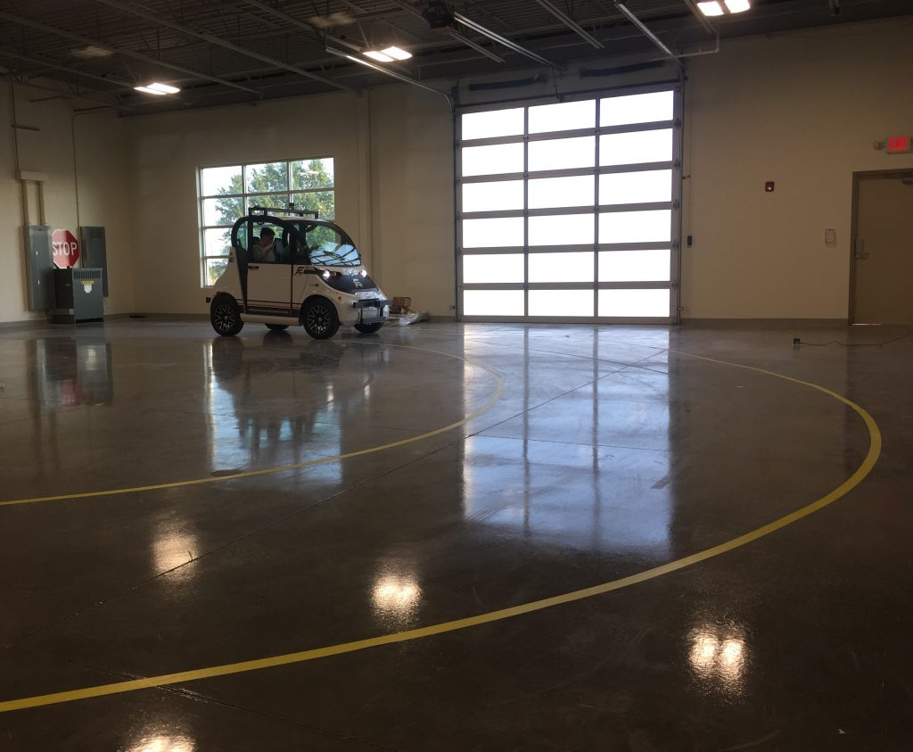
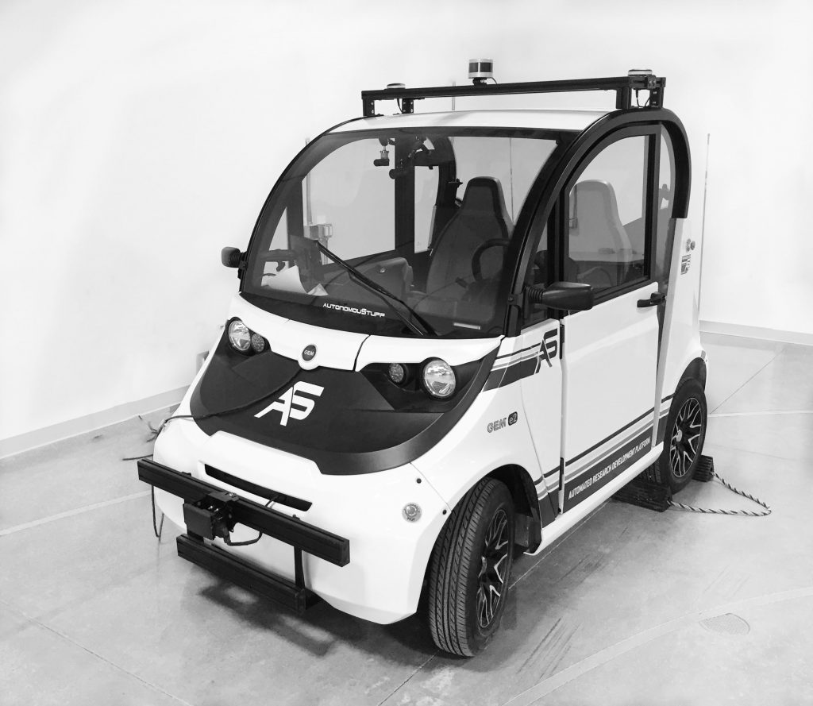
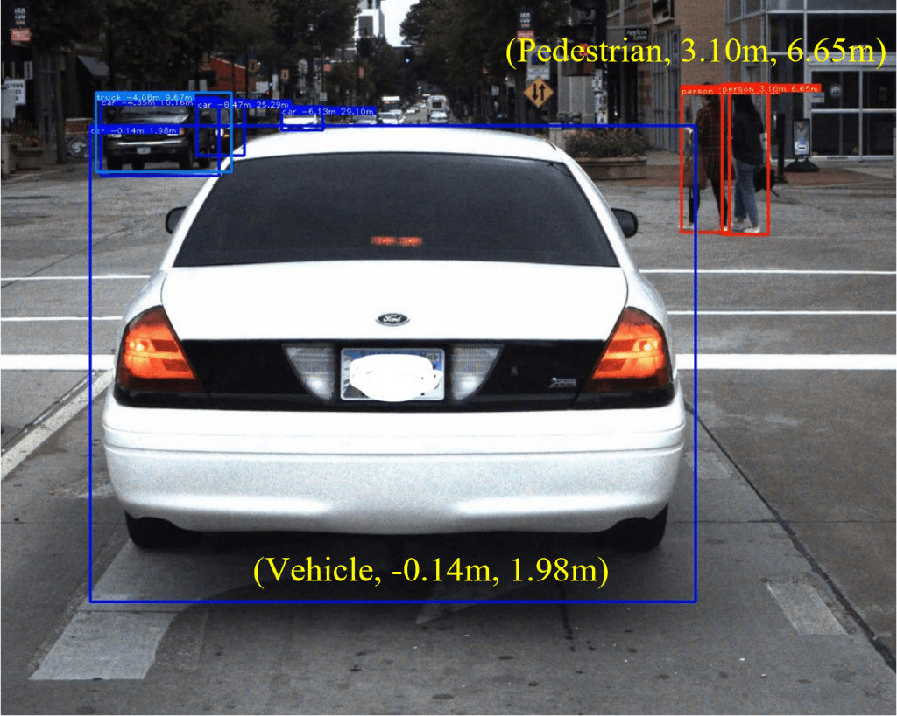
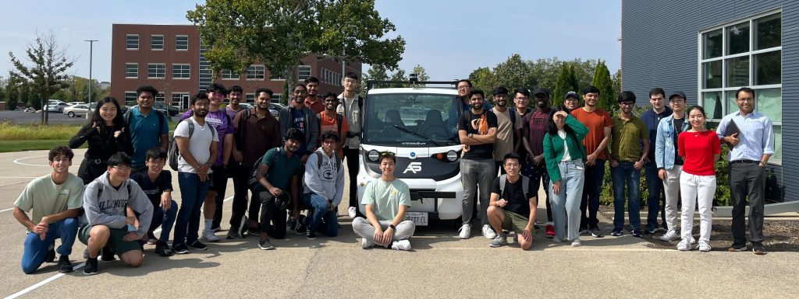
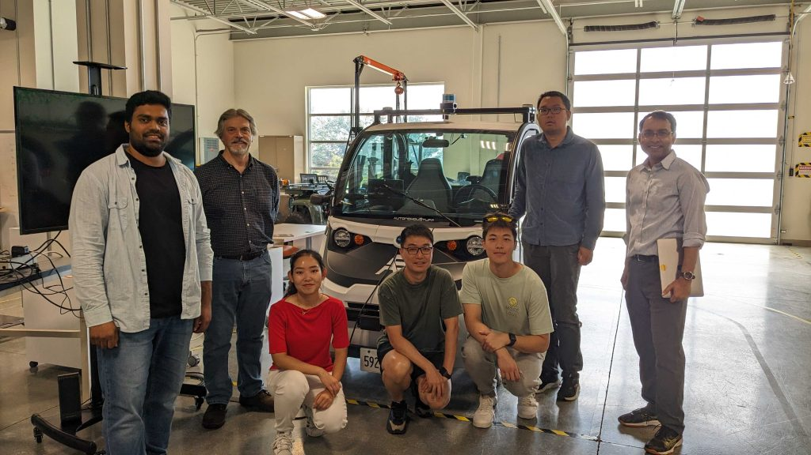

# Overview - Fall 2025

**Welcome to ECE484: Principles of Safe Autonomy, Fall 2025 edition.**

In this class, you will dive into algorithms for building autonomous systems (e.g., path planning, particle filtering, lane detection, and safety verification), play with cool software tools (e.g., ROS, Gazebo, OpenAI gym), and get to deploy your code on a real car!

The class meets **Tuesdays and Thursdays at 11:00am-12:20pm in ECEB 1015.**

Instructor: Prof. [Huan Zhang](https://www.huan-zhang.com/) and Prof. [Sayan Mitra](https://mitras.ece.illinois.edu/) (Chicago section)

Content contributors: [Daniel Zhuang](https://www.linkedin.com/in/daniel-zhuang-9b1864180/), [John Pohovey](https://jhpohovey.github.io), [Yan Miao](https://yanmiao.netlify.app), [Hanna Chen](https://www.linkedin.com/in/hanna-chen-078389223/), [Hyoungju Lim](https://www.linkedin.com/in/hyoungju-lim-656972285/), [Haonan Chen](https://www.linkedin.com/in/haonan-chen-7a4339153/), [Will Chen](https://www.linkedin.com/in/hongyu-chen-91996b22b/), [Jai Anchalia](https://www.linkedin.com/in/jai-anchalia/), [Sidharth Anand](https://www.linkedin.com/in/anand-sidharth/), [Tanvi Kulkarni](https://www.linkedin.com/in/tanvikulk/), [Karteek Gandiboyina](https://www.linkedin.com/in/muralikarteek7/), [Praveen Natarajan](https://www.linkedin.com/in/praveennatarajan123/), [Hongyi Li](hli106@illinois.edu), [Ye-Ji Mun](https://yejimun.github.io), Katherine Braught, [Tianchen Ji](https://tianchenji.github.io), Pranav Sriram, [Qichao Gao](https://www.linkedin.com/in/qichaogao/), [Aamir Hasan](https://aamzhas.github.io), [Minghao Jiang](https://www.linkedin.com/in/minghao-jiang-4a212a127/), Pulkit Katdare, [Yangge Li](https://www.linkedin.com/in/yangge-li-307b4114a/), [Ted Liu](https://www.linkedin.com/in/tianqi-ted-liu-a67647a5/), [Hebron Taylor](https://www.linkedin.com/in/hebron-taylor-9aa1671a0/)

[Hang Cui](https://hangpersonal.com/), Jiaming Zhang, Suraj Nair

Student content contributers:

[Harish Kumar Balaji](https://www.linkedin.com/in/harishkumarbalaji/), [Vikram Raj Nagoor Kani](https://vikramraj.netlify.app/), Manan Hitesh Maheshwari, Vikram Battalapalli, Don Lazatin, Cheng Zhu, Dhruv Agarwal, Aditya Pillai