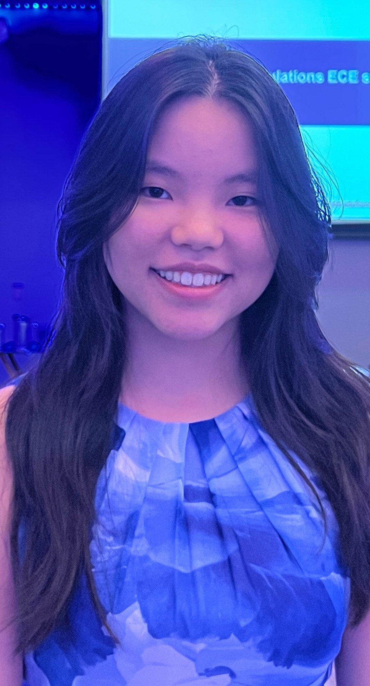
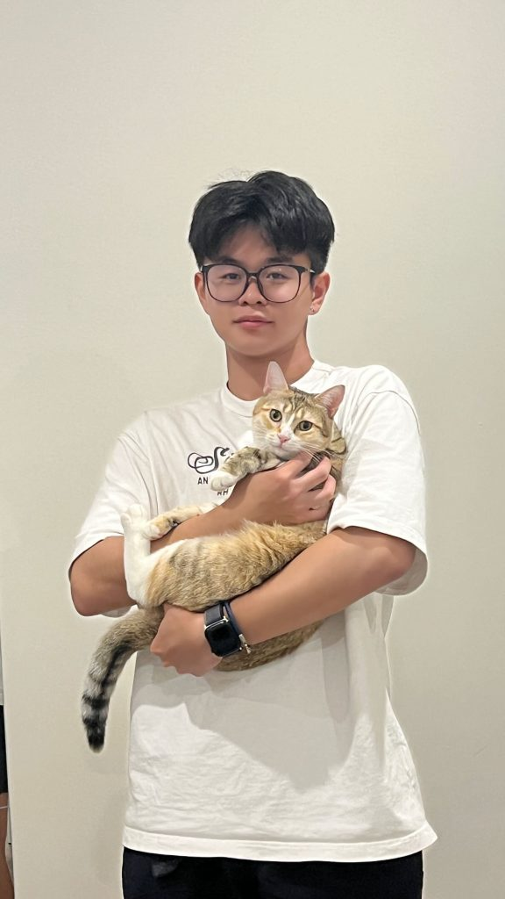
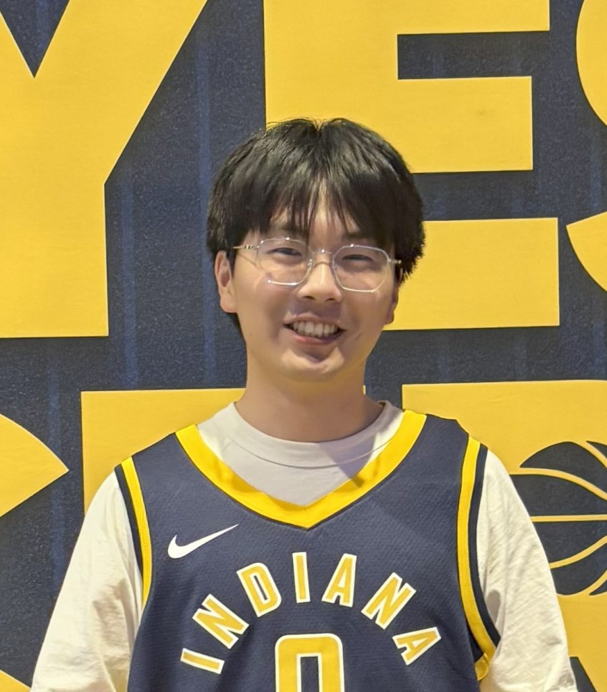
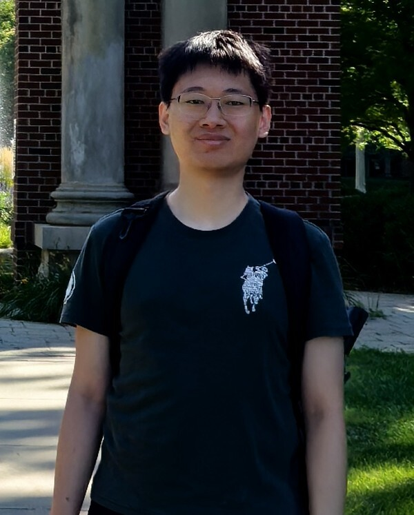
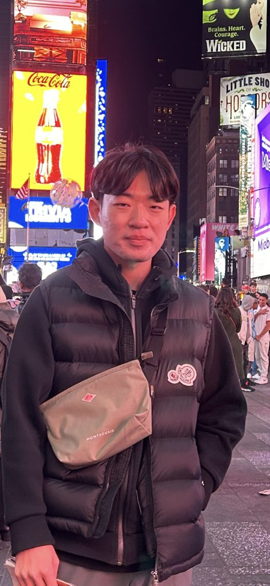

# Team - Fall 2025

## **Instructors**

|  |  |  |
| --- | --- | --- |
|  |  |  |
| Prof. Huan Zhang (huanz) | Prof. Sayan Mitra (mitras) |  |

## Grad TAs

|  |  |  |
| --- | --- | --- |
|  |  |  |
| Hanna Chen (hannac4) | Will Chen (hongyuc5) | Han Wang (hanw14) |
|  |  |  |
| James Menezes (jamesdm4) | Xiangru Zhong (xiangru4) | Fatemeh Cheraghi (fatemeh5) |

## **Undergrad CAs**

|  |  |  |
| --- | --- | --- |
|  |  |  |
| Hyoungju Lim (hl89) | Tanvi Kulkarni (tanvik4) | Yanhao Yang (yanhaoy2) |
|  |  |  |
| Bach Hoang (bachh2) |  |  |

# **Office Hours**

| **TA** | **Day/Time** | **Location** |
| --- | --- | --- |
| Hanna | Thursday 5PM | ECEB 5072 |
| Fatemeh | Thursday 2PM | ECEB 5072 |
| Xiangru | Wednesday 4PM | ECEB 5072 |
| Han | Wednesday 1PM | ECEB 5072 |
| James | Thursday 10AM | ECEB 5072 |

Instructor (Prof. Huan Zhang) office hours: Book [here](https://cal.com/huanzhang/zhang-in-person-hour) for in-person and [here](https://cal.com/huanzhang/zhang-virtual-office-hour) for online

# Lab Sessions

| **Session No.** | **TA** | **CA** |
| --- | --- | --- |
| AB1 (10am-11am) | James | Bach |
| AB2 (11am-12pm) | Han | Yanhao |
| AB3 (5pm-6pm) | Hanna | Hyoungju |
| AB4 (6pm-7pm) | Xiangru | Tanvi |
| AB5 (7pm-8pm) | Fatemeh | Tanvi |

## Lab space (ECEB5072) usage

You can verify at this link [https://my.ece.illinois.edu/classplanning/roomsched.asp](https://my.ece.illinois.edu/classplanning/roomsched.asp), but as of Aug 13th, ECEB5072 is reserved by other courses during the following times:

Tuesday, 2:30 PM - 4:20 PM  
Wednesday, 9:00 AM - 10:50 AM  
Wednesday, 2:00 PM - 3:50 PM  
Friday, 3:00 PM - 4:40 PM

Please be aware that during these times, **you will not be able to work in the lab,** as the lab workstations will be occupied by the students registered for the various classes during these above times. Outside of these times, you are free to come in at any time to work on the MPs or project (especially during office hours!)
